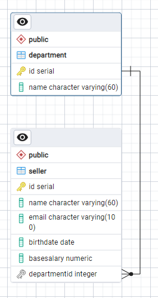

## DAO Design Pattern

<p>DAO (Data Access Object) é um padrão de projeto de software que promove uma separação clara 
entre a lógica de negócios e o acesso aos dados, facilitando a manutenção, teste e evolução do sistema.</p>

<p>Implementação do DAO em seu projeto:</p>

1. <b>Interface DAO (src/model/dao)</b>: Define a interface que encapsula as operações de acesso aos dados, como inserir, atualizar,
excluir e recuperar. Esta interface contém métodos abstratos para cada operação.

```java
public interface SellerDao {
    void insert(Seller obj);
    void update(Seller obj);
    void deleteById(Integer id);
    Seller findById(Integer id);
    List<Seller> findAll();
    List<Seller> findByIdDepartment(Integer Id);
}
```

2. <b>Implementação DAO (src/model/dao/impl)</b>: Fornece a implementação concreta dos métodos definidos na interface DAO. 
Esta classe é responsável por interagir diretamente com o banco de dados para executar as operações CRUD 
(Create, Read, Update, Delete). As operações de query SQL são realizadas utilizando a <a src="https://docs.oracle.com/javase/8/docs/api/java/sql/Connection.html"> 
Interface Connection.</a>

```java
public class SellerDaoJDBC implements SellerDao {

    private Connection conn;

    public SellerDaoJDBC(Connection conn){
        this.conn = conn;
    }

    @Override
    public void insert(Seller seller){
        // JDBC SQL commands
    }
    // Rest of the code
}
```

3. <b>Entidade (src/model)</b>: Representa os objetos que serão armazenados e recuperados do banco de dados.
Geralmente, são classes simples que contêm apenas atributos, getters e setters. Estes objetos devem
possuir, como atributos, todas as colunas da tabela que representa.

```java
public class Seller {
    private Integer id;
    private String name;
    private String email;
    private Date birthDate;
    private Double baseSalary;
    
    // Foreign key to Department table
    private Department department;
}
```

4. <b>Factory DAO (src/model/dao)</b>: Fábrica que cria as instâncias da interface DAO. 
Isso pode ser útil para permitir a troca fácil de implementações DAO sem modificar o código cliente.

```java
public class DaoFactory {
    public static SellerDao createSellerDao(){
        return new SellerDaoJDBC(DB.getConnection());
    }
}
```

### About the Code
<div>
<p>Este programa implementa o padrão de projeto DAO realizando um CRUD em um sistema de cadastro de vendedores (Sellers). 
Cada vendedor possui uma chave estrangeira para algum elemento da tabela Department.O banco utilizado foi o PostgreSQL</p>



<p>Para realizar queries em um banco de dados com java, precisamos de uma interface chamada JDBC.
O JDBC (Java Database Connectivity) é uma API (Interface de Programação de Aplicativos) Java que permite 
que aplicativos Java se conectem a bancos de dados relacionais, executem consultas SQL e manipulem dados
resultantes. Ele fornece uma maneira padrão para que os desenvolvedores de aplicativos Java acessem 
bancos de dados, independentemente do tipo de banco de dados que estão usando.</p>
</div>

### How to use
- Tenha o PostgreSQL (versão 16.2 windows 11) instalada em seu computador
- git clone, abra com sua IDE favorita (InteliJ)
- Crie uma database no pgAdmin (ex. nome: estudos_java, owner: postgres)
- Execute os comandos sql em database/database.sql
- Instale manualmente o driver JDBC em database/postgresql-42.7.3.jar. A instalação é nas libraries do projeto
- Insira a url, user e password do seu banco postgreSQL em App.java
- Rode App.java

### How it works
<p>O programa inicia utilizando a fábrica para instanciar sellerDao, que contém todos os métodos de acesso
ao banco. Este método recebe a url, usuário e senha do banco para realizar a conexão:</p>

```java
SellerDao sellerDao = DaoFactory.createSellerDao(
        "jdbc:postgresql://localhost:5432/estudos_java",
        "postgres",
        "0000"
);
```
<p>Este método estático instancia a implementação que criamos de SellerDao, chamada de SellerDaoJDBC.
O método getConnection() faz a conexão com banco de dados e retorna o objeto <i>conn</i> ao SellerDaoJDBC,
que irá enviar os comandos SQL por meio desta conexão</p>

```java
public static SellerDao createSellerDao(String url, String user, String password){
    return new SellerDaoJDBC(DB.getConnection(url, user, password));
}
```

<p>Agora basta utilizar os métodos de sellerDao para realizar as consultas com o banco. Os métodos disponíveis são: </p>

```java
public void insert(Seller seller);
public void update(Seller seller);
public void deleteById(Integer id);
public Seller findById(Integer id);
public List<Seller> findAll();
public List<Seller> findByIdDepartment(Integer id);
```

Caso qualquer alteração no banco seja feita, o código fonte não precisa ser alterado.